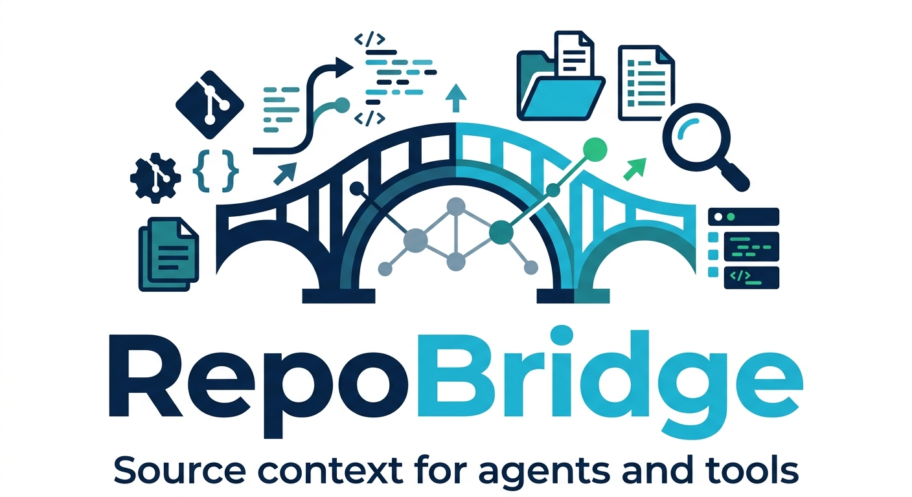

<p align="center">
  
</p>

<h1 align="center">RepoBridge</h1>

<p align="center">
  <strong>Fetch package and repository source code into stable local paths for coding agents and developer tooling.</strong>
</p>

<p align="center">
  <a href="https://github.com/arkadiuszczarnik/repobridge"></a>
  
  
  
  
</p>

## Introduction

`repobridge` is a small Go CLI for turning package or repository specs into local source trees and searchable AST-Graph Engine indexes. It supports npm, pypi, crates.io, maven, nuget, and common git repository hosts.

## Benchmark

The E2E Token-Reduction-Benchmark compares `repobridge search` with comparable `rg -C 3` output on a pinned Kotlin repository. The current run shows that structured AST search returns much smaller outputs for LLM context while preserving code-level intent such as function and call matching.

| Task | Results | RepoBridge tokens | rg tokens | Estimated reduction |
| --- | ---: | ---: | ---: | ---: |
| Find Kotlin up function | 2 | 224 | 444 | 49.5% |
| Find functions calling exec | 9 | 928 | 2575 | 64.0% |
| Find functions calling ps | 3 | 320 | 1310 | 75.6% |
| Find docker compose resolver | 1 | 96 | 576 | 83.3% |

## Features

- Resolve package specs from npm, pypi, crates.io, maven, and nuget.
- Fetch Git repositories from GitHub, GitLab, and Bitbucket.
- Scan a project for dependency source specs from manifests, lockfiles, and imports.
- Build local Tree-sitter AST graphs for cached sources and search them by symbol, kind, path, language, and calls.
- Store structure containment edges from files and modules to classes, functions, methods, fields, properties, imports, and nested types.
- Index framework routes and handlers as graph nodes, including HTTP method, route pattern, file, and line.
- Inspect cached AST-Graph Engine indexes with `status`, `files`, and `node` without scanning source trees again.
- Traverse graph edges with `callers`, `callees`, and `impact` for focused agent investigations, including `--edge contains`.
- Build task-oriented agent context with `context` and broader graph explanations with `explore`.
- Reuse a stable local cache across repeated agent/tool runs.
- Detect installed npm package versions from `node_modules`, lockfiles, and `package.json`.
- Print machine-friendly paths for downstream automation.


## Requirements

- Go 1.26.3 or newer
- `git` available on `PATH`

## Installation

Install the latest CLI binary:

```bash
curl -fsSL https://raw.githubusercontent.com/agentsw0rk/repobridge/main/install.sh | bash
```

Or build/install from the repository root:

```bash
go install ./cmd/repobridge
```

For a local binary:

```bash
go build -o ./bin/repobridge ./cmd/repobridge
./bin/repobridge --version
```

## Quick Start

RepoBridge is designed to sit behind a coding agent. The agent uses it to fetch dependency sources, build AST-Graph Engine indexes, and ask targeted questions without reading entire repositories.

Install the bundled RepoBridge skill for a coding agent:

```bash
repobridge install-agent --target codex --version v0.6.0
repobridge install-agent --target codex --dry-run
repobridge install-agent --target codex --print-config
```

`install-agent` writes only the RepoBridge skill files for the selected agent target.

From a project root, scan dependencies and fetch source references for the agent:

```bash
repobridge scan --cwd . --fetch --limit 10
```

You can also prepare specific sources manually:

```bash
repobridge fetch react@19.0.0 vercel/next.js
repobridge path react
repobridge path pypi:requests==2.32.3
repobridge path github.com/vercel/next.js
```

Use the CLI directly when you want to inspect what the agent can query:

```bash
repobridge search react@19.0.0 "kind:function name:render"
repobridge search pypi:requests==2.32.3 "calls:send lang:python"
repobridge context react@19.0.0 "createRoot render flow" --budget small
repobridge callers react@19.0.0 createRoot --depth 2
```

Route indexing covers Spring Java/Kotlin annotations, Express and React Router routes, FastAPI/Flask/Django routes, Gin/chi/gorilla/mux registrations, ASP.NET controller and Minimal API routes, and Rust Axum/actix/Rocket-style route shapes.

Inspect graph health, indexed files, and exact nodes:

```bash
repobridge status react@19.0.0
repobridge files react@19.0.0 --path packages/react-dom --limit 10
repobridge node react@19.0.0 createRoot --source-lines 20
repobridge callees maven:org.jetbrains.kotlin:kotlin-stdlib@2.0.20 commonMain/kotlin/collections/ArrayList.kt --edge contains
```

Trace deeper relationships when needed:

```bash
repobridge callers github.com/acme/service AuthController.login --depth 1
repobridge callees react@19.0.0 createRoot --include-unresolved
repobridge callees maven:org.jetbrains.kotlin:kotlin-stdlib@2.0.20 be0e02a37d825e799fa669f4577829b23229936d --edge contains --limit 20
repobridge impact react@19.0.0 createRoot --json
```

Build broader task context:

```bash
repobridge context github.com/acme/service "POST /login" --budget small
repobridge explore github.com/vercel/next.js "AppRouter cache invalidation" --budget large --depth 2
```

Inspect and clean cached sources:

```bash
repobridge list
repobridge list --json
repobridge remove react
repobridge clean --repos
```

## Supported Inputs

| Input | Example |
| --- | --- |
| npm package | `react`, `react@19.0.0`, `@scope/package@1.2.3` |
| pypi package | `pypi:requests`, `pypi:requests==2.32.3` |
| crates.io package | `crates:serde`, `crates:serde@1.0.217` |
| maven artifact | `maven:org.jetbrains.kotlin:kotlin-stdlib@2.1.0` |
| NuGet package | `nuget:Newtonsoft.Json`, `nuget:Newtonsoft.Json@13.0.3`, `dotnet:Serilog@3.1.1` |
| GitHub shorthand | `vercel/next.js` |
| Repository host | `github.com/vercel/next.js`, `gitlab.com/group/project` |
| Full URL | `https://github.com/vercel/next.js` |

Package inputs default to npm. Use a registry prefix for non-npm packages.

Maven inputs use `groupId:artifactId@version`. RepoBridge reads Maven repositories from `pom.xml`, local parent POMs, active Maven profiles, and `settings.xml` mirrors under `--cwd`, then tries source JARs in repository order. It falls back to SCM metadata from the POM only after source JAR lookup misses in the configured repositories. If no project repository configuration is found, Maven's default Central repository is used.

Maven repository support is intentionally lightweight. It does not resolve remote parent POMs, decrypt Maven server credentials, apply proxy settings, or build a full Maven effective model.

NuGet inputs use package IDs with an optional version. RepoBridge selects the latest stable version when omitted, reads repository metadata from the `.nupkg`, and caches only the matching source repository.

AST-Graph Engine indexing uses Tree-sitter for Go, Java, Kotlin, C#, JavaScript, TypeScript, Python, and Rust. It also indexes framework routes for Spring, Express, React Router, FastAPI, Flask, Django, Gin, chi, gorilla/mux, ASP.NET, Axum, actix, and Rocket.

The graph includes structure containment as normal `contains` edges. Each indexed source file gets a stable `file` node, package and namespace scopes become `module` nodes when they are statically visible, and local declarations are attached to their primary parent. For example, `file -> module -> class -> method` lets an agent ask what a file or class contains without reconstructing ownership from paths and line ranges. The Kotlin stdlib fixture `maven:org.jetbrains.kotlin:kotlin-stdlib@2.0.20` indexes with schema version `27` and exposes `ArrayList.kt --contains--> kotlin.collections.ArrayList` plus class-to-member containment edges.

Call graph resolution stores call sites as structured references with callee name, receiver text, argument count/texts, source scope, and location. Callable nodes also store qualified names, receiver type, parameter count/types, and return type when Tree-sitter syntax exposes them. The resolver prefers same-file and same-receiver candidates, requires argument counts to match, and leaves ties as unresolved references instead of guessing.

Indexes are built in the background after `path`, `fetch`, and `scan --fetch`. Commands that need an index rebuild missing or stale data synchronously unless `--no-sync-index` is set.

## Commands

| Command | Description |
| --- | --- |
| `repobridge fetch <spec...>` | Downloads sources into the cache. |
| `repobridge path <spec...>` | Fetches on cache miss and prints absolute source paths. |
| `repobridge scan` | Scans a project and proposes dependency source specs. |
| `repobridge search <spec> <query>` | Searches the local AST graph for a cached source, including framework routes such as `kind:route path:/login`, building the graph synchronously if needed. |
| `repobridge status <spec>` | Shows graph path, freshness status, schema version, file/node/edge counts, and warnings. |
| `repobridge files <spec>` | Lists files stored in the AST graph without walking the source tree again. |
| `repobridge node <spec> <id-or-name>` | Shows one symbol's kind, qualified name, location, calls, and optional source lines. |
| `repobridge callers <spec> <symbol>` | Finds functions, methods, routes, or structural parents related to a symbol. |
| `repobridge callees <spec> <symbol>` | Finds called symbols or contained children, depending on the selected edge kind. |
| `repobridge impact <spec> <symbol>` | Traverses incoming call/import/containment relationships to estimate change impact. |
| `repobridge context <spec> <query>` | Returns focused task context with entry points, relationships, snippets, related files, warnings, and stats. |
| `repobridge explore <spec> <query>` | Returns broader graph exploration context with the same bounded output shape. |
| `repobridge install-agent` | Installs the bundled RepoBridge skill for Codex, Claude, Cursor, opencode, or all targets. |
| `repobridge list [--json]` | Lists cached packages and repositories. |
| `repobridge remove <spec...>` | Removes selected cached sources. |
| `repobridge clean` | Removes cached sources, optionally scoped by flags. |

Common command flags:

| Command group | Useful flags |
| --- | --- |
| Version-aware commands | `--cwd` for lockfile and manifest detection. |
| `fetch` | `--quiet` to suppress progress output. |
| `path` | `--verbose` to show fetch progress. |
| `scan` | `--json`, `--fetch`, `--limit`, `--no-imports`. |
| `search` | `--json`, `--limit`, `--kind`, `--lang`, `--path`, `--calls`, `--no-sync-index`. |
| `status`, `files`, `node`, `callers`, `callees`, `impact`, `context`, `explore` | `--json`, `--no-sync-index`. |
| `files` | `--path`, `--limit`. |
| `node` | `--source-lines`. |
| `callers`, `callees`, `impact` | `--depth`, `--edge`, `--kind`, `--lang`, `--path`, `--limit`, `--include-unresolved`. |
| `context`, `explore` | `--budget`, `--limit`, `--depth`. |
| `install-agent` | `--target`, `--version`, `--dry-run`, `--print-config`. |
| `clean` | `--packages`, `--repos`, `--npm`, `--pypi`, `--crates`, `--maven`, `--nuget`. |

Useful search query tokens include `kind:file`, `kind:module`, `kind:route`, `kind:handler`, `kind:component_route`, `path:/some/route`, `lang:python`, `calls:<symbol>`, and free text such as `POST /login`. Graph traversal edge filters include `calls`, `imports`, `handles`, `routes_to`, `middleware`, and `contains`.

## Configuration

| Variable | Description |
| --- | --- |
| `REPOBRIDGE_HOME` | Cache directory. Defaults to `~/.repobridge`. |
| `GITHUB_TOKEN` | Token for GitHub API calls and private GitHub repositories. |
| `GITLAB_TOKEN` | Token for private GitLab repositories. |
| `BITBUCKET_TOKEN` | Token for private Bitbucket repositories. |

The cache contains cloned source trees and a `sources.json` index under `REPOBRIDGE_HOME`. Repository fetches remove `.git` so the cache stores source snapshots rather than nested working trees.

After successful `path`, `fetch`, and `scan --fetch` calls, RepoBridge starts background AST indexing for the cached source. Graph data is stored beside the source in `.repobridge-graph/`; command output remains unchanged. The first `search`, `status`, `files`, `node`, `callers`, `callees`, `impact`, `context`, or `explore` call builds a missing or stale graph synchronously unless `--no-sync-index` is set.

## Development

Run the CLI from source:

```bash
go run ./cmd/repobridge --version
```

Run checks before submitting changes:

```bash
gofmt -w ./cmd ./internal
go test ./...
go vet ./...
```

Tests are colocated with implementation files as `*_test.go`. Lockfile fixtures live in `internal/lockfile/testdata/`.

Project scanning also has an opt-in end-to-end test that clones pinned public GitHub projects into the ignored `e2e/` directory and verifies scanner output across Maven, Gradle, NuGet, JavaScript, PyPI, and crates projects:

```bash
go test -tags=e2e ./test/e2e-scan -count=1
```

AST-Graph Engine search has an opt-in end-to-end test that checks the real `repobridge search` CLI against a pinned Kotlin repository and writes a Markdown output-budget report comparing `repobridge search` with `rg -C 3`:

```bash
go test -tags=e2e ./test/e2e-search -count=1 -v
```

The report is written to `e2e/search/results/search-output-budget.md`.

Use verbose mode to see each repository, commit, sparse checkout path, expected specs, and scanner results:

```bash
go test -tags=e2e ./test/e2e-scan -count=1 -v
```

Set `REPOBRIDGE_E2E_REFRESH=1` to delete and re-fetch the local E2E checkouts.

## License

Licensed under the Apache License 2.0. See [LICENSE](LICENSE).
